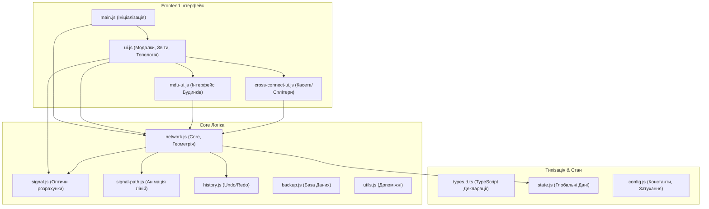

# PON-Designer — Посібник користувача та Документація

**PON Designer** — це універсальний спеціалізований веб-інструмент для проектування пасивних оптичних мереж (PON). Програма дозволяє інженерам будувати топологію на карті, автоматично та в реальному часі розраховувати затухання сигналу, валідувати коректність схеми і формувати звіти з кошторисом для реалізації проекту.

---

## 🎯 Можливості системи для користувача

### 1. Моделювання мережі

- **Панель інструментів (Drag-and-Drop):** Додавайте обладнання (OLT, Муфти, FOB, багатоквартирні будинки MDU, абонентські термінали ONU), просто перетягуючи їх з лівої панелі на карту.
- **Два типи ліній:**
  - **Магістральний кабель (Cable):** З’єднує OLT та вузли (Муфти/FOB, MDU) між собою. Дозволяє вказувати ємність (кількість волокон).
  - **Абонентський кабель (Patchcord):** З'єднує кінцевого абонента (ONU або Квартиру) з портом найближчого дільника.
- **Редагування трас:** Завдяки вбудованому режиму **"Коригування вузлів" (Geoman)**, ви можете створювати будь-яку кількість вигинів на кабелі, щоб прокласти його точно по вулицях або стовпах.
- **Товщина та Колір:** Кабелі автоматично змінюють градієнти кольорів залежно від рівня сигналу, а підсвічування товстими лініями дозволяє візуалізувати напрямки від OLT до споживача.

### 2. Властивості та Налаштування обладнання

- При натисканні на будь-який об'єкт праворуч відкривається **Панель властивостей** з деталізованими налаштуваннями.
- **OLT (Комутатор):** Налаштування вихідної потужності (дБм), кількості PON-портів, ліміту абонентів, кросування через **Оптичний крос (ODF)**.
- **FOB та Муфти:**
  - **Безлімітні дільники:** Додавайте будь-яку кількість та комбінацію сплітерів: **FBT** (несиметричні 5/95, 10/90, 50/50 тощо) та **PLC** (симетричні 1x2, 1x4, 1x8, 1x128).
  - **Візуальна ідентифікація (Кольори та Фігури):** Кожен унікальний дільник отримує власний унікальний колір, що полегшує кросування. Для надійності використовуються геометричні символи: `⬢` (Головні дільники/Муфти), `⯁` (Поверхи), `◼` (Оптичний Кабель), `●` (Патчкорд).
  - **Касета (Зварювання):** Спеціальне модальне вікно мат�### 3. Оптичний калькулятор (Real-time)

- Система миттєво рахує бюджет втрат при будь-яких змінах на мапі.
- Автоматично перераховується сигнал для всієї гілки при: зміні типу дільника, зміні довжини кабелю, додаванні вузла, перекросуванні.

### 4. Інтерфейс та UX

- **Професійний Workspace:** Інтерфейс перетворено на професійний робочий простір. У верхній частині знаходиться глобальна панель (Top Bar) для задання імені проєкту, а внизу — рядок статусу (Status Bar), що відображає координати та зум у реальному часі.
- **Уніфікована кольорова палітра:** Усі шари інтерфейсу (кнопки бічної панелі, маркери на карті, легенда, тултипи, попапи) використовують єдину систему кольорів: OLT — синій `#58a6ff`, FOB — зелений `#3fb950`, Муфта — золотий `#e3b341`, ONU — кораловий `#ff7b72`, MDU — фіолетовий `#a371f7`.

### 5. Колірна Семантика та Стантифікація (Routes & Signals)

Для запобігання когнітивним конфліктам система чітко розмежовує два типи візуальної інформації:

- **Індикатори якості сигналу**: Відображаються виключно в підписах і модальних вікнах обладнання за допомогою круглих кольорових точок:
  - 🟢 OK (≥ -26 дБ)
  - 🟡 Межа (-26 .. -29 дБ)
  - 🔴 Слабкий (< -29 дБ)
  - ⚫ Немає сигналу (згасання або відсутність підключення ).
- **Маркери маршрутів (Route Markers)**: Стосуються ліній оптичних кабелів. Колір магістралі на карті означає **лише ідентифікацію дерева від OLT-порту** і не пов'язаний з якістю сигналу:
  - За замовчуванням система використовує "холодну" контрастну PON-палітру (Blue, Pink, Cyan, Purple, Light Blue тощо) для кожного порту OLT.
  - Користувачі можуть встановлювати **Кастомний (власний) колір** для будь-якого дерева прямо у вікні розварки (`cross-connect-ui` для OLT).
  - Магістраль без активного підключення завжди стає стандартною сірою (`#8b949e`), автоматично блокуючи кастомний колір.у вікні. Сигнали та статуси `[Зайнято]` у випадаючих списках оновлюються миттєво під час комутації без перезавантаження модального вікна.

* **Універсальна топологія райзерів:** Архітектура не обмежує вас жорсткими вертикалями. Ви маєте абсолютну свободу зробити "перемичку" (зварити абонентів одного під'їзду з дільником в іншому під'їзді), зберігаючи достовірність магістрального обліку сигналу.
* Окремий режим **FTTB** (оптика до будівлі) із встановленням активного обладнання та коефіцієнтом проникнення (%) для розрахунку ємності Провайдера.

### 3. Оптичний калькулятор (Real-time)

- Система миттєво рахує бюджет втрат при будь-як�- **Кнопка "Звіт та Економіка":**
  - **Бюджет розрахункових втрат (Loss Budget):** Детальна таблиця, що аналізує кожен Вузол (Муфту) та MDU.
    - **Аналіз ланцюга (Trace):** Система автоматично простежує повний фізичний шлях сигналу від OLT до обраного вузла.
    - **Деталізація втрат:** Відображає вихідну потужність OLT, затухання на кожному відрізку кабелю, механічні втрати на зварках та специфічні втрати для кожного типу дільника (FBT/PLC).
    - **Текстовий маршрут:** Додає розгортаний опис "Ланцюга", що дозволяє інженеру верифікувати схему проходження світла.
  - **Кошторис (Економічна специфікація BOM):** Інженерний алгоритм формує список реалістичних витрат "до гвинтика".
    - **Інтелектуальний підбір:** Система сама обирає оптимальні моделі боксів (наприклад, FOB-02 для 4 абонентів або FOB-04 для 16) та муфт залежно від щільності зварок.
    - **Повний перелік розхідників:** Автоматичний облік натяжних та анкерних затискачів, КДЗС, адаптерів, пігтейлів та SFP-модулів.
    - **Excel-сумісність:** Експорт у CSV містить готові формули для швидкого коригування цін.терфейс перетворено на професійний робочий простір. У верхній частині знаходиться глобальна панель (Top Bar) для задання імені проєкту, а внизу — рядок статусу (Status Bar), що відображає координати та зум у реальному часі.
- **Уніфікована кольорова палітра:** Усі шари інтерфейсу (кнопки бічної панелі, маркери на карті, легенда, тултипи, попапи) використовують єдину систему кольорів: OLT — синій `#58a6ff`, FOB — зелений `#3fb950`, Муфта — золотий `#e3b341`, ONU — кораловий `#ff7b72`, MDU — фіолетовий `#a371f7`.
- **Ергономічна панель інструментів:** Всі кнопки керування та інструменти згруповано у стильну, компактну 2-рядну сітку на лівій панелі. Кожен компонент має унікальний кольоровий акцент та об'ємну іконку (наприклад, 🗄️ OLT).
- **Перемикач шарів карти (Layer Picker):** Випадаючий список «Шари» на нижній панелі інструментів використовує іконки Font Awesome (`fa-map`, `fa-satellite`, `fa-layer-group`) з фіксованою шириною для ідеального вирівнювання. Glassmorphism-дизайн із `backdrop-filter: blur` та виділенням активного шару синім акцентом.
- **Інтелектуальні підписи (Smart Tooltips):** Багатошарова система маркерів на карті з Anti-Clutter алгоритмами.
  - При низькому масштабі (< 16) відображаються лише компактні назви для уникнення візуального шуму (повні дані підтягуються при наведенні `Hover`).
  - При наближенні (зум 16 і вище) тултипи MDU та ONU автоматично розгортаються, демонструючи вичерпні параметри (порти, рівні сигналів).
  - **Авторозподіл лідерами (Arc Layout):** Для щільних скупчень абонентів навколо спільних муфт, система автоматично "виштовхує" їхні тултипи по візуальному напівколу за допомогою ліній-виносок (Leader lines), гарантуючи, що текст ніколи не буде накладатися один на одного.
- **Динамічний Компас:** Якщо ви збільшили масштаб і загубили центр свого проекту, на карті з'явиться віртуальний навігатор, який вкаже напрямок і дистанцію в метрах до найближчого об'єкта.
- **Smart Search (Пошук локації):** Універсальне поле пошуку на панелі інструментів автоматично розпізнає формат вводу. Якщо ввести координати (наприклад `49.42, 27.00`), карта миттєво перелітає на них. Якщо текст — виконується онлайн-пошук адреси через OpenStreetMap. Окрім цього, після переходу координати на 5 секунд дублюються у Status Bar для підтвердження.
- **Локатор шляху:** При виділенні об'єкта пунктирна анімація покаже шлях проходження світла від джерела (OLT) до обраної точки.

### 5. Колірна Семантика та Інженерне Маркування

Для запобігання когнітивним дисонансам та максимального наближення до інженерних креслень, система застосовує чітку семантику:

- **Індикатори якості сигналу**: Відображаються в легендах і підписах виключно у вигляді круглих точок (🟢 OK, 🟡 Межа, 🔴 Слабкий, ⚫ Немає).
- **Маркери маршрутів (кабелів)**: Колір лінії магістралі на карті означає лише **ідентифікацію дерева від OLT-порту**.
  - Для магістралей підключених портів використовується контрастна PON-палітра (Blue, Pink, Cyan тощо).
  - Користувач може задати **Кастомний колір** гілки через Color Picker у меню `Оптичний крос`.
  - При повному від'єднанні магістралі від активних портів, пікер блокується і лінія стає нейтрально сірою (`#8b949e`), щоб візуально відокремити транзитну оптику без світла від робочої.
- **Креслярське маркування дистанцій (Тултипи)**: Підказки на магістралях використовують класичний інженерний стиль для вимірювальних ліній. Вони містять локальну довжину відрізка (`← X м →`) та сумарну оптичну дистанцію поточного маршруту від самого OLT (`→ Σ Y м ←`).

### 6. Аналітика, Збереження та Експорт

- **Бюджет розрахункових втрат (Loss Budget):** Детальна таблиця, що аналізує кожен Вузол та MDU.
  - **Аналіз ланцюга (Trace):** Автоматично простежує фізичний шлях сигналу від OLT до кінцевого ONU.
  - **End-to-End маршрут:** Текстовий опис ланцюга включає повний шлях до абонента: `OLT → кабель 210м → [FBT 10/90] → … → Drop-кабель 50м → ONU (-22.5 дБ)`. Серед усіх підключених ONU обирається worst-case (найслабший сигнал).
  - **Деталізація втрат:** Відображає вихідну потужність, затухання кабелю, втрати на зварках та специфічні втрати дільників.
- **Кошторис (Економічна специфікація BOM):** Інженерний алгоритм формує список реалістичних матеріалів з інтелектуальною класифікацією вузлів.
  - **Трирівнева класифікація:** Система автоматично визначає тип кожного вузла на основі його фізичних з'єднань:
    - _Транзитна муфта_ — тільки магістральні кабелі без сплітерів → мінімальний набір КДЗС.
    - _Крос-муфта (розподільча)_ — магістралі + сплітери, без абонентських drop-портів → КДЗС для магістралі та сплітерів.
    - _Бокс PON (FOB)_ — наявні абонентські порти → повний комплект: адаптери SC/UPC, пігтейли, КДЗС, підбір моделі Crosver (FOB-02..FOB-05) за кількістю портів.
  - **Пріоритезація імен:** Якщо ви дали вузлу унікальне ім'я, воно ніколи не зникне — система збереже його в таблиці, прив'яже правильні матеріали і допише підказку про базову модель.
  - **Освітні референси:** Розхідникам в кошторисі додано детальні описи-підказки, наприклад: `Гільза КДЗС (зварювання абонентських пігтейлів у боксі FOB)`, `Drop-кабель (армований кабель "останньої милі" від муфти до абонента)`.

- **Кнопка "Звіт та Економіка":**
  - **Бюджет розрахункових втрат (Loss Budget):** Детальна таблиця, що аналізує кожен Вузол (Муфту) та MDU. Відображає всі вхідні магістралі, розраховує затухання на відстані, механічні втрати та виводить найгірший сигнал на портах дільників безпосередньо з матриці внутрішніх кросувань.
  - **Кошторис (Економічна специфікація BOM):** Інженерний алгоритм формує список реалістичних витрат "до гвинтика". Розраховує не тільки Муфти та MDU, а й супутні розхідники за їхню ємністю: Натяжні затискачі кабелю, Гільзи КДЗС під зварки, Адаптери та Пігтейли для PON-боксів, Конектори для дроп-кабелів, та SFP трансівери. Усі ці дані інтелектуально групуються по логічним категоріям для зручного перенесення в Excel.
- **Валідація помилок (Бадж):** Червоний лічильник на панелі постійно сканує проект на наявність вузлів-"сиріт" (не підключених до мережі) або абонентів зі слабким сигналом.
- **Синхронізація назв звітів:** Всі ваші вивантажені файли автоматично успадковують назву поточного проєкту з Верхньої панелі.
- **Експорт у CSV / TXT:** Завантажує таблицю Excel зі звітом (числа форматуються з комою для сумісності з українською локалізацією MS Excel).
- **Графічний експорт PNG:** Зберігайте ідеальні знімки структурної топології дерева або самої мапи в один клік. Система використовує нативний рендеринг SVG-to-Canvas, що гарантує відсутність обрізаних країв та незалежність від масштабу (zoom) у вікні перегляду.
- **Бекапи (Auto-save):** Всі дії локально автозберігаються (технологія IndexedDB). Також є можливість зробити знімок поточного стану: зберегти проект у JSON-файл на комп'ютер.
- **Історія дій (Undo/Redo):** Повна підтримка скасування (`Ctrl+Z`) та повернення (`Ctrl+Y`) дій: малювання, переміщення, зміна властивостей.

---

## ⌨️ Гарячі клавіші та інструменти

- **Пробіл (Space) утримувати:** Переміщення карти (Pan) під час малювання ліній.
- **Ctrl + Z:** Скасувати останню дію (Undo).
- **Ctrl + Y:** Повернути скасовану дію (Redo).
- **Escape (Esc):** Скасувати режим малювання або скинути поточне виділення.
- **Delete:** Видалити вибраний вузол або магістраль.

---

## 🛠️ Архітектура проєкту (Для розробників)

Проєкт побудований за сучасною модульною системою (ES Modules) на чистому JavaScript, але з суворою типізацією через JSDoc TypeScript. Це забезпечує максимальну швидкість рендерингу в браузері без необхідності налаштовувати процес компіляції (`webpack` чи `vite`), але з повним контролем розуміння типів.

### 🧩 Основні модулі

1. **`types.d.ts`**: Серце типізації. Містить декларації всіх інтерфейсів, гарантуючи перевірку помилок (0 errors) через `tsc --noEmit`.
2. **`state.js`**: Централізований віртуальний стан `nodes`, `conns` та об'єкт-посилання `map`.
3. **`network.js`**: Головний рушій: DOM та геометрія Leaflet, створення поліліній, перетягування маркерів, базові підписи (Tooltips).
4. **`signal.js`**: Логіка маршрутизації втрат (dB). Реалізує DFS/графічний обхід для прорахунку деревовидних дільників в Муфтах та складних кросувань на поверхах MDU.
5. **`history.js`**: Реалізація патерну Command для скасування змін (дифи або повні снепшоти).
6. **`ui.js`**: Взаємодія з модальними вікнами: звіти, CSV, валідація, керування проектами та рендеринг складної ієрархічної топології через **Mermaid.js**.
7. **`cross-connect-ui.js`**: Модуль "Касети", що візуалізує та зберігає матрицю внутрішніх з'єднань між жилами та сплітерами. Володіє технологією "тихого збереження" (`skipGlobalRefresh`) для усунення перевантажень DOM під час масової розварки користувачем.
8. **`mdu-ui.js`**: Модуль архітектури MDU, що генерує поверхові розводки (FTTH) та керує призначенням квартир користувачам.

---

_Проєкт орієнтується на максимальну швидкодію без серверної логіки (на 100% Client-Side SPA). Використовує апаратне прискорення GPU для SVG-анімацій та ізольовані оновлення стану в модальних вікнах, дозволяючи обробляти тисячі об'єктів без затримок у браузері користувача._
