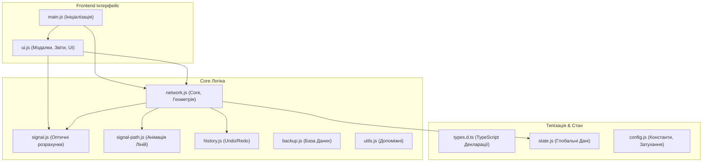

# PON-Designer — Посібник користувача та Документація

**PON Designer** — це універсальний спеціалізований веб-інструмент для проектування пасивних оптичних мереж (PON). Програма дозволяє інженерам будувати топологію на карті, автоматично та в реальному часі розраховувати затухання сигналу, валідувати коректність схеми і формувати звіти з кошторисом для реалізації проекту.

---

## 🎯 Можливості системи для користувача

### 1. Моделювання мережі

- **Панель інструментів (Drag-and-Drop):** Додавайте обладнання (OLT, екранні муфти/FOB, абонентські термінали ONU), просто перетягуючи їх з лівої панелі на карту.
- **Два типи ліній:**
  - **Магістральний кабель (Cable):** З’єднує OLT та муфти FOB між собою. Рахується довжина та втрати світла в кабелі.
  - **Абонентський кабель (Patchcord):** З'єднує кінцевого абонента (ONU) з портом найближчого вузла FOB. Легке візуальне відокремлення.
- **Редагування трас:** Завдяки вбудованому режиму **"Коригування вузлів" (Geoman)**, ви можете створювати будь-яку кількість вигинів на кабелі, щоб прокласти його точно по вулицях або стовпах.
- **Товщина та Колір:** Кабелі автоматично змінюють градієнти кольорів залежно від рівня сигналу, а підсвічування товстими лініями дозволяє візуалізувати напрямки від OLT до споживача.

### 2. Властивості та Налаштування обладнання

- При натисканні на будь-який об'єкт праворуч відкривається **Панель властивостей**.
- **OLT (Комутатор):** Налаштування вихідної потужності (дБм), кількості PON-портів, допустимого ліміту абонентів на порт.
- **FOB (Муфта/Бокс):** Встановлення оптичних дільників:
  - **FBT (Несиметричні):** Наприклад, `10/90`, де на прохід іде 90% сигналу, а в бокс падає 10%.
  - **PLC (Симетричні):** Наприклад, `1x4`, `1x8`, сигнал ділиться порівну між усіма виходами.
- За допомогою панелі властивостей ви можете **перемикати абонентів між гілками** дільників.

### 3. Оптичний калькулятор (Real-time)

- Система миттєво рахує бюджет втрат при будь-якій зміні (переміщення вузла, додавання відводу, зміна дільника).
- **Втрати враховують:** Затухання оптоволокна (на метр довжини), механічні з'єднання (пігтейли/адаптери), втрати на всіх каскадах сплітерів.
- **Кольорова індикація:** Зелений (запас сигналу відмінний), Жовтий (близько до порогу), Червоний (сигнал гірше чутливості ONU — потрібна оптимізація).

### 4. Розумний інтерфейс (UI/UX)

- **Інтелектуальні підписи (Tooltips):** Якщо поруч стоїть 20 будинків (ONU), система виконає **Анти-Колізію**, радіально розташувавши підписи навколо маркерів із вказівниками, щоб вони не перекривали один одного.
- **Динамічний Компас:** Якщо ви збільшили масштаб і загубили центр свого проекту, на карті з'явиться віртуальний компас, який вкаже напрямок і дистанцію в метрах до найближчого об'єкта.
- **Локатор шляху:** При виділенні об'єкта пунктирна анімація покаже шлях проходження світла від джерела (OLT) до обраної точки, допомагаючи аналізувати складні деревоподібні топології.

### 5. Аналітика, Збереження та Експорт

- **Кнопка "Звіт та Економіка":** Генерує зведену таблицю всіх ліній, відхилень та перевантажень. Також на основі доданих елементів формує "Кошторис" (сумує однотипне обладнання: напр., "FOB (модель не вказана) — 15 шт.").
- **Валідація помилок (Бадж):** Червоний лічильник на панелі постійно сканує проект на наявність вузлів-"сиріт" (не підключених до мережі) або абонентів зі слабким сигналом.
- **Експорт у CSV:** Завантажує таблицю Excel зі звітом (числа форматуються з комою для сумісності з українською локалізацією MS Excel).
- **Бекапи (Auto-save):** Всі дії локально автозберігаються (технологія IndexedDB). Також є можливість зробити знімок поточного стану: зберегти проект у JSON-файл на комп'ютер, експортувати схему у PNG.
- **Історія дій (Undo/Redo):** Повна підтримка скасування (`Ctrl+Z`) та повернення (`Ctrl+Y`) дій: малювання, переміщення, зміна властивостей.

---

## ⌨️ Гарячі клавіші та інструменти

- **Пробіл (Space) утримувати:** Переміщення карти (Pan) під час малювання ліній.
- **Ctrl + Z:** Скасувати останню дію (Undo).
- **Ctrl + Y:** Повернути скасовану дію (Redo).
- **Escape (Esc):** Скасувати режим малювання або скинути поточне виділення.
- **Delete:** Видалити вибраний вузол або магістраль.

---

## 🛠️ Архітектура проєкту (Для розробників)

Проєкт побудований за сучасною модульною системою (ES Modules) на чистому JavaScript, але з суворою типізацією через JSDoc TypeScript. Це забезпечує максимальну швидкість рендерингу в браузері без необхідності налаштовувати процес компіляції (`webpack` чи `vite`), але з повним контролем розуміння типів.

### 🧩 Основні модулі

1. **`types.d.ts`**: Серце типізації. Містить декларації всіх інтерфейсів, гарантуючи перевірку помилок (0 errors) через `tsc --noEmit`.
2. **`state.js`**: Централізований віртуальний стан `nodes`, `conns` та об'єкт-посилання `map`.
3. **`network.js`**: Головний рушій: DOM та геометрія Leaflet, створення поліліній, перетягування маркерів.
4. **`signal.js`**: Логіка маршрутизації втрат (dB). Реалізує DFS/графічний обхід для прорахунку деревиних сплітерів.
5. **`history.js`**: Реалізація патерну Command для скасування змін (дифи або повні снепшоти).
6. **`ui.js`**: Взаємодія з модальними вікнами: звіти, CSV, валідація, керування проектами.

---

_Проєкт орієнтується на максимальну швидкодію без серверної логіки (на 100% Client-Side SPA), дозволяючи обробляти тисячі об'єктів без затримок у браузері користувача._
