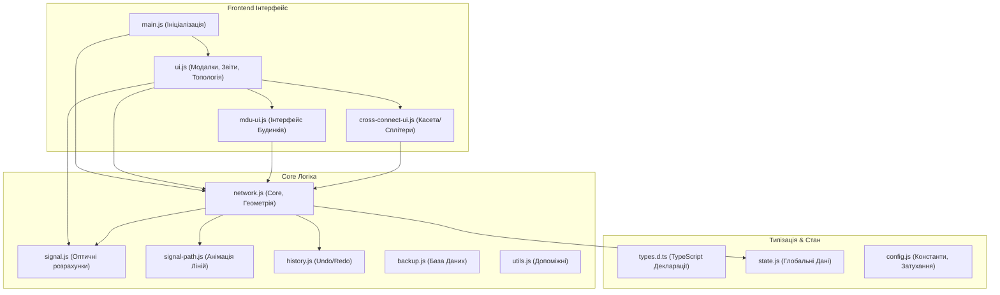

# PON-Designer — Посібник користувача та Документація

**PON Designer** — це універсальний спеціалізований веб-інструмент для проектування пасивних оптичних мереж (PON). Програма дозволяє інженерам будувати топологію на карті, автоматично та в реальному часі розраховувати затухання сигналу, валідувати коректність схеми і формувати звіти з кошторисом для реалізації проекту.

---

## 🎯 Можливості системи для користувача

### 1. Моделювання мережі

- **Панель інструментів (Drag-and-Drop):** Додавайте обладнання (OLT, Муфти, FOB, багатоквартирні будинки MDU, абонентські термінали ONU), просто перетягуючи їх з лівої панелі на карту.
- **Два типи ліній:**
  - **Магістральний кабель (Cable):** З’єднує OLT та вузли (Муфти/FOB, MDU) між собою. Дозволяє вказувати ємність (кількість волокон).
  - **Абонентський кабель (Patchcord):** З'єднує кінцевого абонента (ONU або Квартиру) з портом найближчого дільника.
- **Редагування трас:** Завдяки вбудованому режиму **"Коригування вузлів" (Geoman)**, ви можете створювати будь-яку кількість вигинів на кабелі, щоб прокласти його точно по вулицях або стовпах.
- **Товщина та Колір:** Кабелі автоматично змінюють градієнти кольорів залежно від рівня сигналу, а підсвічування товстими лініями дозволяє візуалізувати напрямки від OLT до споживача.

### 2. Властивості та Налаштування обладнання

- При натисканні на будь-який об'єкт праворуч відкривається **Панель властивостей** з деталізованими налаштуваннями.
- **OLT (Комутатор):** Налаштування вихідної потужності (дБм), кількості PON-портів, ліміту абонентів, кросування через **Оптичний крос (ODF)**.
- **FOB та Муфти:**
  - **Безлімітні дільники:** Додавайте будь-яку кількість та комбінацію сплітерів: **FBT** (несиметричні 5/95, 10/90, 50/50 тощо) та **PLC** (симетричні 1x2, 1x4, 1x8, 1x128).
  - **Візуальна ідентифікація (Кольори та Фігури):** Кожен унікальний дільник отримує власний унікальний колір, що полегшує кросування. Для надійності використовуються геометричні символи: `⬢` (Головні дільники/Муфти), `⯁` (Поверхи), `◼` (Оптичний Кабель), `●` (Патчкорд).
  - **Касета (Зварювання):** Спеціальне модальне вікно матриці з'єднань, де можна гнучко комутувати транзитні жили магістралі або послідовно каскадувати дільники (напр. FBT -> PLC).
- **MDU (Багатоквартирний будинок):**
  - **Гнучка конфігурація:** Вкажіть кількість поверхів, під'їздів та квартир на поверсі.
  - **Схема під'їзду (FTTH):** Деталізована матриця (Горище -> Поверхи), що дозволяє розподіляти волокна між будинковими та поверховими дільниками аж до конкретних квартир. Відображає розрахунковий рівень сигналу безпосередньо у вікні перед комутацією.
  - **Універсальна топологія райзерів:** Архітектура не обмежує вас жорсткими вертикалями. Ви маєте абсолютну свободу зробити "перемичку" (зварити абонентів одного під'їзду з дільником в іншому під'їзді), зберігаючи достовірність магістрального обліку сигналу.
  - Окремий режим **FTTB** (оптика до будівлі) із встановленням активного обладнання та коефіцієнтом проникнення (%) для розрахунку ємності Провайдера.

### 3. Оптичний калькулятор (Real-time)

- Система миттєво рахує бюджет втрат при будь-якій зміні (переміщення вузла, додавання відводу, зміна дільника).
- **Втрати враховують:** Затухання оптоволокна (на метр довжини), механічні з'єднання (пігтейли/адаптери), втрати на всіх каскадах сплітерів.
- **Кольорова індикація:** Зелений (запас сигналу відмінний), Жовтий (близько до порогу), Червоний (сигнал гірше чутливості ONU — потрібна оптимізація).

### 4. Розумний інтерфейс (UI/UX)

- **Інтелектуальні підписи (Tooltips):** Мульти-шарова система маркерів на карті. При віддаленні об'єми даних розвантажуються, залишаючи назви (Anti-Clutter). При наближенні – відображається вичерпна інформація (порти, втрати, рівні сигналів, точні шляхи ліній від джерела).
- **Динамічний Компас:** Якщо ви збільшили масштаб і загубили центр свого проекту, на карті з'явиться віртуальний навігатор, який вкаже напрямок і дистанцію в метрах до найближчого об'єкта.
- **Локатор шляху:** При виділенні об'єкта пунктирна анімація покаже шлях проходження світла від джерела (OLT) до обраної точки.
- **Авто-генерація Топології:** Підтримка рендерингу деревоподібних оптичних графів (Mermaid.js) з відображенням внутрішньої інфраструктури (вложених сплітерів MDU та FOB).

### 5. Аналітика, Збереження та Експорт

- **Кнопка "Звіт та Економіка":** Генерує зведену таблицю всіх ліній, відхилень та перевантажень. Також на основі доданих елементів формує "Кошторис" (сумує однотипне обладнання: напр., "FOB (модель не вказана) — 15 шт.").
- **Валідація помилок (Бадж):** Червоний лічильник на панелі постійно сканує проект на наявність вузлів-"сиріт" (не підключених до мережі) або абонентів зі слабким сигналом.
- **Експорт у CSV:** Завантажує таблицю Excel зі звітом (числа форматуються з комою для сумісності з українською локалізацією MS Excel).
- **Бекапи (Auto-save):** Всі дії локально автозберігаються (технологія IndexedDB). Також є можливість зробити знімок поточного стану: зберегти проект у JSON-файл на комп'ютер, експортувати схему у PNG.
- **Історія дій (Undo/Redo):** Повна підтримка скасування (`Ctrl+Z`) та повернення (`Ctrl+Y`) дій: малювання, переміщення, зміна властивостей.

---

## ⌨️ Гарячі клавіші та інструменти

- **Пробіл (Space) утримувати:** Переміщення карти (Pan) під час малювання ліній.
- **Ctrl + Z:** Скасувати останню дію (Undo).
- **Ctrl + Y:** Повернути скасовану дію (Redo).
- **Escape (Esc):** Скасувати режим малювання або скинути поточне виділення.
- **Delete:** Видалити вибраний вузол або магістраль.

---

## 🛠️ Архітектура проєкту (Для розробників)

Проєкт побудований за сучасною модульною системою (ES Modules) на чистому JavaScript, але з суворою типізацією через JSDoc TypeScript. Це забезпечує максимальну швидкість рендерингу в браузері без необхідності налаштовувати процес компіляції (`webpack` чи `vite`), але з повним контролем розуміння типів.

### 🧩 Основні модулі

1. **`types.d.ts`**: Серце типізації. Містить декларації всіх інтерфейсів, гарантуючи перевірку помилок (0 errors) через `tsc --noEmit`.
2. **`state.js`**: Централізований віртуальний стан `nodes`, `conns` та об'єкт-посилання `map`.
3. **`network.js`**: Головний рушій: DOM та геометрія Leaflet, створення поліліній, перетягування маркерів, базові підписи (Tooltips).
4. **`signal.js`**: Логіка маршрутизації втрат (dB). Реалізує DFS/графічний обхід для прорахунку деревовидних дільників в Муфтах та складних кросувань на поверхах MDU.
5. **`history.js`**: Реалізація патерну Command для скасування змін (дифи або повні снепшоти).
6. **`ui.js`**: Взаємодія з модальними вікнами: звіти, CSV, валідація, керування проектами та рендеринг складної ієрархічної топології через **Mermaid.js**.
7. **`cross-connect-ui.js`**: Модуль "Касети", що візуалізує та зберігає матрицю внутрішніх з'єднань між жилами та сплітерами всередині Муфт/FOB.
8. **`mdu-ui.js`**: Модуль архітектури MDU, що генерує поверхові розводки (FTTH) та керує призначенням квартир користувачам.

---

_Проєкт орієнтується на максимальну швидкодію без серверної логіки (на 100% Client-Side SPA), дозволяючи обробляти тисячі об'єктів без затримок у браузері користувача._
