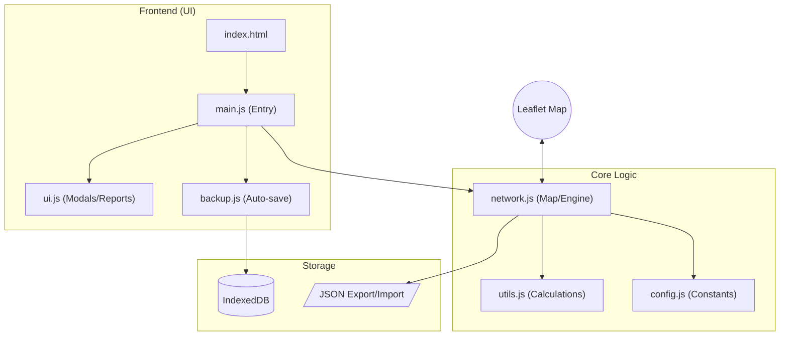

# PON Designer — Documentation

## 📝 Загальний опис проєкту

**PON Designer** — це спеціалізований веб-інструмент для проектування пасивних оптичних мереж (PON). Додаток дозволяє інженерам та проектувальникам моделювати топологію мережі на карті, автоматично розраховувати оптичний бюджет (затухання) та валідувати коректність з'єднань.

## 🏗️ Архітектура додатку

Проєкт побудований за модульним принципом на чистому JavaScript (ES6+), що забезпечує швидкість та легкість підтримки без важких фреймворків.

### 🧩 Основні модулі:

1.  **`main.js`**: Вхідна точка. Керує ініціалізацією та експортує API для глобального доступу (кнопки HTML).
2.  **`network.js`**: "Мозок" системи. Керує станом Leaflet-карти, вузлами, з'єднаннями та логікою розрахунку сигналів.
3.  **`ui.js`**: Відповідає за відображення модальних вікон, дерева топології та звітів.
4.  **`config.js`**: Містить константи затухань (FBT/PLC), пороги чутливості та загальні налаштування.
5.  **`backup.js`**: Система автозбереження та бекапів на базі **IndexedDB**, що дозволяє зберігати історію змін локально в браузері.
6.  **`utils.js`**: Допоміжні функції для розрахунків та маніпуляцій з даними.

## 🚀 Ключовий функціонал

### 1. Моделювання топології

- Додавання вузлів (OLT, FOB, ONU) перетягуванням або кліком.
- Побудова магістральних ліній та абонентських патчкордів.
- Можливість редагування вигинів кабелів (за допомогою Leaflet-Geoman).

### 2. Оптичний калькулятор (Real-time)

- Автоматичний розрахунок затухання від OLT до кожної ONU.
- Підтримка складних каскадів FBT-дільників (процентні) та PLC-сплітерів.
- Врахування затухання в самому кабелі (дБ/км) та на механічних з'єднаннях.

### 3. Розумний інтерфейс (UI/UX)

- **Hybrid Tooltip Layout**: Автоматичне розведення підписів ONU при зближенні, радіальні виноски з leader lines для щільних кластерів.
- **Interactive Zoom Indicator**: Слайдер та кнопки для швидкого керування масштабом.
- **Signal Animation**: Візуалізація напрямку сигналу штриховою анімацією.

### 4. Аналітика та Експорт

- Формування детального звіту (специфікація матеріалів, перелік портів, рівні сигналів).
- Експорт проєкту в JSON для обміну файлами.
- Експорт схеми в PNG.

## 🛠️ Стек технологій

- **Leaflet.js**: Картографічна основа.
- **Leaflet-Geoman**: Інструменти для малювання та редагування геометрії.
- **Vanilla CSS**: Кастомна темна преміум-тема з акцентом на читабельність.
- **IndexedDB**: Локальна база даних для надійних бекапів.
- **html2canvas**: Для генерації зображень схеми.

---

_Проєкт розроблено з акцентом на UX та точність інженерних розрахунків._
